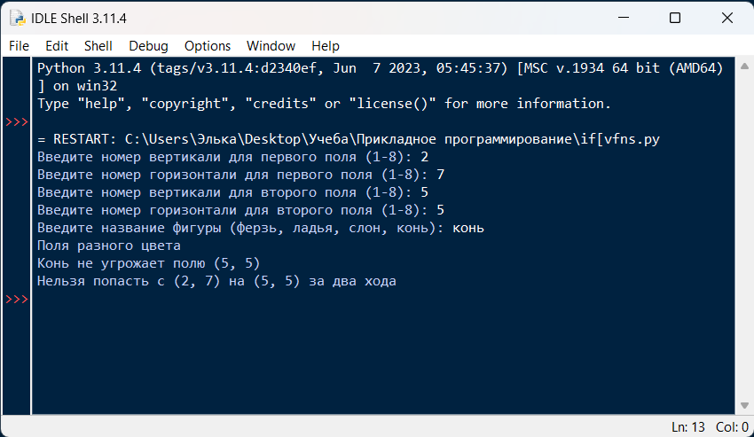
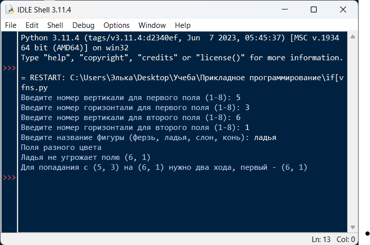
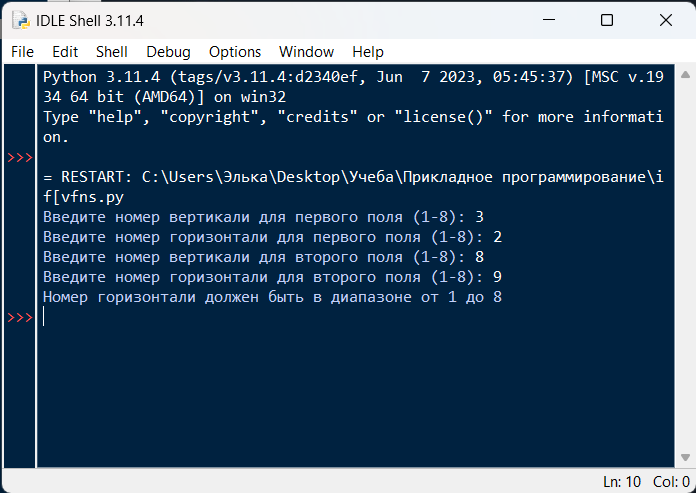

# Лабораторная работа №3

# Исполнитель
Громова Эльвира  
Группа ФТ-220007

# Задание
Условные операторы if/else - Шахматы

Постановка задачи:  
Поле шахматной доски определяется парой натуральных чисел,
каждое из которых не превосходит восьми:  
первое число — номер вертикали (при счете слева направо),  
второе число — номер горизонтали (при счете снизу вверх).  
Даны натуральные числа k, l, m, n,
каждое из которых не превосходит восьми.  

Требуется:  
а) Выяснить, являются ли поля (k, I) и (m, n) полями одного цвета.  
6) На поле (к, I) расположен ферзь, ладья, слон или конь (должен ввести пользователь). Угрожает ли он полю (m, n)?  
в) Выяснить, можно ли с поля (k, I) одним ходом ладьи, ферзя или слона (должен ввести пользователь) попасть на поле (m, n). Если нет, то выяснить, как это можно сделать за два хода (указать поле, на которое приводит первый ход).

Задание:  
Написать на любом языке программу: решения поставленной задачи.
Входные данные: натуральные числа k, l, m, n, наименования фигур для пп. б и в  
Выходные данные: ответы на поставленные вопросы ( пп. а – в ) в удобочитаемом виде.

# Среда разработки
Язык программирования: Python  
Среда разработки: IDLE

# Инструкция по работе
При открытии файла FT220007-Gromova.py необходимо ввести 4 числа, которые соответсвуют диапазону указанному в задании. Ввести название фигуры. Запустить программу

# Тесты
1 тест  

2 тест  

3 тест  

